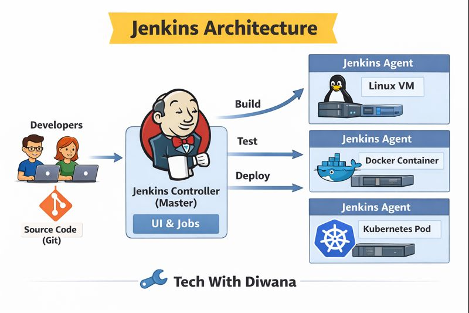

# 🚀 Day 1 – CI/CD Basics, DevOps Overview & Jenkins Architecture

---

## 📌 Introduction

This is **Day 1** of the **Jenkins CI/CD Mastery Series** by **Tech With Diwana**.

The goal of Day 1 is to build **strong fundamentals** before touching Jenkins pipelines.
If your foundation is clear, Jenkins becomes easy.

---

## 🧠 What is DevOps?

DevOps is **not a tool**.

DevOps is a **culture and practice** that improves collaboration between:
- Development teams
- Operations teams

### Problems Before DevOps
- Manual deployments
- Slow releases
- Blame game during failures
- No ownership

### What DevOps Solves
- Automation of build and deployment
- Faster releases
- Shared responsibility
- Stable production systems

> **Interview Line:**  
> DevOps improves delivery speed and system reliability through automation and collaboration.

---

## 🔁 What is CI/CD?

CI/CD is the backbone of DevOps.

### ✅ Continuous Integration (CI)
Whenever developers push code:
- Code is built automatically
- Tests are executed
- Code quality checks run

CI ensures broken code never reaches production.

---

### 🚚 Continuous Delivery
- Code is automatically built and tested
- Deployed to staging or pre-production
- **Manual approval required for production**

Production is always ready, but deployment is controlled.

---

### 🚀 Continuous Deployment
- Every successful change
- Automatically goes to production
- **No manual approval**

> **Key Difference:**  
> Continuous Delivery stops before production.  
> Continuous Deployment goes live automatically.

---

## 🧩 What is Jenkins?

Jenkins is an **open-source CI/CD automation server**.

### Why Jenkins?
- Open-source and free
- Huge plugin ecosystem
- Works with Git, Docker, Kubernetes, Cloud
- Enterprise proven

> Jenkins is not just a tool, it is a **CI/CD orchestration engine**.

---

## 🕰️ Short History of Jenkins

- Jenkins was created in **2011**
- Forked from the Hudson project
- Became popular due to flexibility and plugins
- Still widely used in enterprises today

---

## 🏗️ Jenkins Architecture (High-Level)

Jenkins follows a **Controller–Agent architecture**.

### 🧠 Jenkins Controller (Master)
- Manages UI & REST API
- Stores job and pipeline configurations
- Schedules builds
- Should remain lightweight

⚠️ Controller should **never run heavy builds**.

---

### ⚙️ Jenkins Agents (Workers)
- Execute actual build, test, deploy jobs
- Can run on:
  - Linux VM
  - Docker Container
  - Kubernetes Pod

This design allows Jenkins to **scale horizontally**.

---

## 🖼️ Architecture Diagram

Below is the high-level Jenkins architecture used in production:

---

## 🎯 What You Learned Today

- DevOps fundamentals
- CI vs Continuous Delivery vs Continuous Deployment
- Jenkins overview and use cases
- Jenkins Controller–Agent architecture

---

## 🔜 What’s Next (Day 2)

**Day 2:** Jenkins Installation
- Linux installation
- Docker-based Jenkins
- Cloud VM setup

---

📺 **YouTube:** Tech With Diwana  
📦 **Repository:** jenkins-ci-cd-mastery

🔥 *Strong foundations build strong pipelines.*
