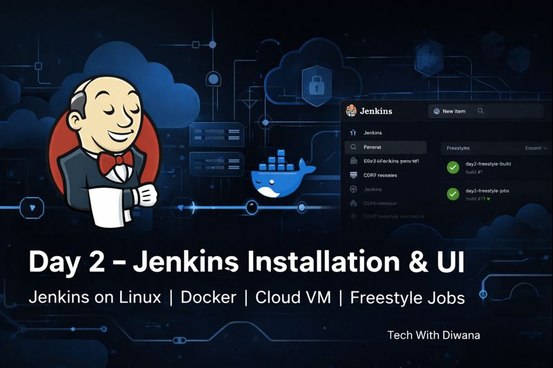

# 🚀 Day 2 – Jenkins Installation & UI




---

## 🎯 Objective (Day-2 Scope Only)

This day covers **Jenkins Installation & UI**:
- Jenkins on Linux (proper production install)
- Jenkins with Docker (alternate method)
- Jenkins on Cloud VM (GCP)
- HTTPS using NGINX reverse proxy
- Jenkins UI walkthrough
- Freestyle Job (Basic CI)
- Docker image as build artifact

❌ Pipelines, Webhooks, Kubernetes & DevSecOps are **NOT** part of Day-2.

---

## 🧰 Prerequisites

### Local Machine
- Windows 10/11
- PowerShell
- Google Cloud SDK
- Git

### Cloud
- GCP account (billing enabled)
- Domain name (for HTTPS demo)

---

## 🟦 PHASE 0 – Create Jenkins VM on GCP

### Create VM (PowerShell)

```powershell
gcloud compute instances create jenkins-vm `
  --zone asia-south1-a `
  --machine-type e2-medium `
  --image-family ubuntu-2204-lts `
  --image-project ubuntu-os-cloud `
  --boot-disk-size 30GB `
  --tags jenkins-server
```

### Firewall Rules

```powershell
gcloud compute firewall-rules create jenkins-allow `
  --direction=INGRESS `
  --priority=1000 `
  --network=default `
  --action=ALLOW `
  --rules="tcp:22,tcp:80,tcp:443,tcp:8080" `
  --target-tags=jenkins-server
```

### SSH into VM

```powershell
gcloud compute ssh jenkins-vm --zone asia-south1-a
```

---

## 🟦 PHASE 1 – Jenkins Using Docker (Alternate Demo)

```bash
sudo apt update
sudo apt install -y docker.io
sudo systemctl start docker
sudo usermod -aG docker $USER
newgrp docker
```

```bash
docker run -d \
  -p 8080:8080 \
  -p 50000:50000 \
  -v jenkins_home:/var/jenkins_home \
  --name jenkins-docker \
  jenkins/jenkins:lts
```

Access:
```
http://<VM-IP>:8080
```

Stop container before next phase:
```bash
docker stop jenkins-docker && docker rm jenkins-docker
```

---

## 🟦 PHASE 2 – Jenkins Installation on Linux (MAIN STEP)

### Step 1: Install Java (Mandatory)

```bash
sudo apt update
sudo apt install -y openjdk-17-jdk
java -version
```

### Step 2: Add Jenkins Repository & Key

```bash
curl -fsSL https://pkg.jenkins.io/debian-stable/jenkins.io-2023.key | sudo tee \
  /usr/share/keyrings/jenkins-keyring.asc > /dev/null

echo deb [signed-by=/usr/share/keyrings/jenkins-keyring.asc] \
  https://pkg.jenkins.io/debian-stable binary/ | sudo tee \
  /etc/apt/sources.list.d/jenkins.list > /dev/null
```

### Step 3: Install Jenkins

```bash
sudo apt update
sudo apt install -y jenkins
```

### Step 4: Start & Enable Jenkins

```bash
sudo systemctl start jenkins
sudo systemctl enable jenkins
sudo systemctl status jenkins
```

### Step 5: Unlock Jenkins

```bash
sudo cat /var/lib/jenkins/secrets/initialAdminPassword
```

Access:
```
http://<VM-IP>:8080
```

---

## 🟦 PHASE 3 – HTTPS with NGINX Reverse Proxy

```bash
sudo apt install -y nginx certbot python3-certbot-nginx
```

```nginx
server {
    listen 80;
    server_name jenkins.techwithdiwana.com;

    location / {
        proxy_pass http://127.0.0.1:8080;
        proxy_http_version 1.1;
        proxy_set_header Upgrade $http_upgrade;
        proxy_set_header Connection "upgrade";
        proxy_set_header Host $host;
        proxy_cache_bypass $http_upgrade;
    }
}
```

```bash
sudo ln -s /etc/nginx/sites-available/jenkins.techwithdiwana.com /etc/nginx/sites-enabled/
sudo nginx -t
sudo systemctl reload nginx
sudo certbot --nginx -d jenkins.techwithdiwana.com
```

Access securely:
```
https://jenkins.techwithdiwana.com
```

---

## 🟦 PHASE 4 – Jenkins UI & Freestyle Job

### Create Job
- New Item → `day2-freestyle-build`
- Type → Freestyle project

### Git Configuration

Repository:
```
https://github.com/techwithdiwana/kubernetes-zero-to-hero.git
```

Branch:
```
*/main
```

Sparse Checkout:
```
day13-techwithdiwana_gcp_llm_cluster
```

### Build Step (Minimal – Day-2 Safe)

```bash
cd day13-techwithdiwana_gcp_llm_cluster/frontend
docker build -t day2-frontend-app:latest .
```

Verify:
```bash
docker images | grep day2-frontend-app
```

---

## 

> **This is a simple Freestyle job, mostly used for basic CI.**

---

## 🏁 Day-2 Summary

✔ Jenkins installed on Linux properly  
✔ Jenkins Docker method explained  
✔ HTTPS enabled (production style)  
✔ Jenkins UI covered  
✔ Freestyle CI job executed  
✔ Docker image generated as artifact  

---

**Next:** Day-3 – Git Integration & Build Triggers 🚀
